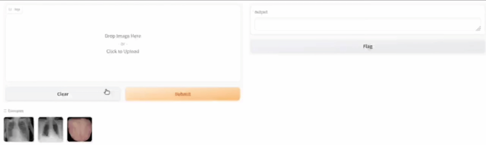
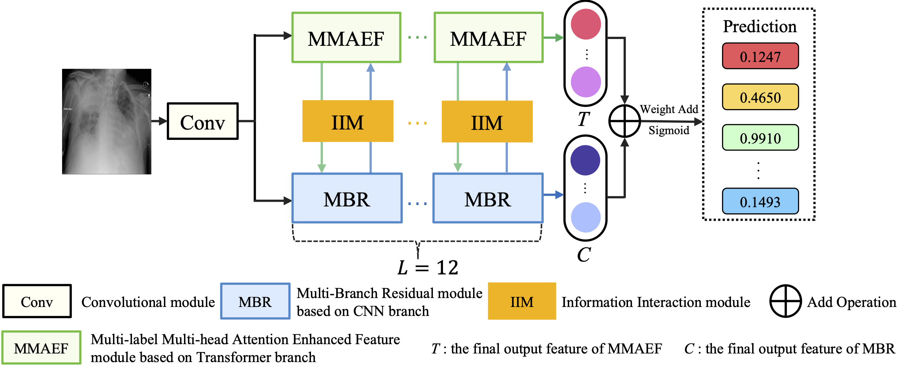
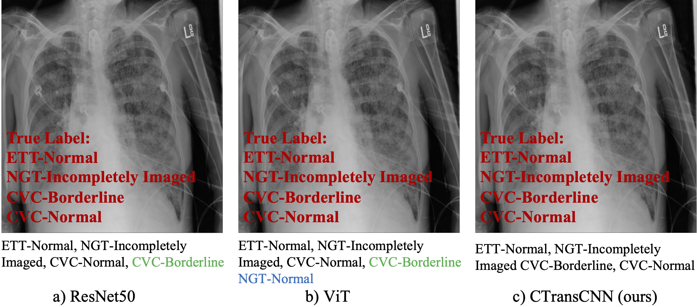

# CTransCNN: Combining Transformer and CNN in Multi-Label Medical Image Classification


## model





## Abstract

Multilabel image classification aims to assign images to multiple possible labels. In this task, each image may be associated with multiple labels, making it more challenging than the single-label classification problems. For instance, convolutional neural networks (CNNs) have not met the performance requirement in utilizing statistical dependencies between labels in this study. Additionally, data imbalance is a common problem in machine learning that needs to be considered for multilabel medical image classification. Furthermore, the concatenation of a CNN and a transformer suffers from the disadvantage of lacking direct interaction and information exchange between the two models. To address these issues, we propose a novel hybrid deep learning model called CTransCNN. This model comprises three main components in both the CNN and transformer branches: a multilabel multihead attention enhanced feature module (MMAEF), a multibranch residual module (MBR), and an information interaction module (IIM). The MMAEF enables the exploration of implicit correlations between labels, the MBR facilitates model optimization, and the IIM enhances feature transmission and increases nonlinearity between the two branches to help accomplish the multilabel medical image classification task. We evaluated our approach using publicly available datasets, namely the ChestX-ray11 and NIH ChestX-ray14, along with our self-constructed traditional Chinese medicine tongue dataset (TCMTD). Extensive multilable image classification experiments were conducted comparing our approach with excellent methods. The experimental results demonstrate that the framework we have developed exhibits strong competitiveness compared to previous research. Its robust generalization ability makes it applicable to other medical multilabel image classification tasks.

## Dataset

1. **ChestX-ray11**: In this study, 30,083 CXR image training data were used for multi-label sample classification due to computer limitations. Link: [kaggle.com/competitions/ranzcr-clip-catheter-line-classification/data](kaggle.com/competitions/ranzcr-clip-catheter-line-classification/data)

2. **NIH ChestX-ray14**:  Due to computational limitations, this study performed multi-label sample classification on 51759 CXR images, named NIH ChestX-ray14, rather than the complete set of 112120 frontal images. Link: [nihcc.app.box.com/v/ChestXray-NIHCC](nihcc.app.box.com/v/ChestXray-NIHCC) 

   **ChestX-ray11** and **NIH ChestX-ray14** are shown in folders chest11 and chest14.

3. The TCMTD is a multi-label classification task for 9 different TCM pathologies, conditions viz. ‘Qixu’ (qi deficiency), ‘Qiyu’ (qi stagnation), ‘Shire’ (damp heat), ‘Tanshi’ (phlegm damp), ‘Tebing’ (idiosyncratic), ‘Xueyu’ (blood stagnation), ‘Yinxu’ (yin deficiency), ‘Pinghe’ (balanced), and ‘Yangxu’ (yang deficiency), which is a multi-label classification task. **Due to ethical and personal privacy issues, this dataset is not publicly available.**

## Citation

We now have a related paper that you can cite in this repository 🤗 . [Download paper](https://www.sciencedirect.com/science/article/pii/S0950705123007803).

```bash
@article{WU2023111030,
  title = {CTransCNN: Combining transformer and CNN in multilabel medical image classification},
  journal = {Knowledge-Based Systems},
  pages = {111030},
  year = {2023},
  issn = {0950-7051},
  doi = {https://doi.org/10.1016/j.knosys.2023.111030},
  url = {https://www.sciencedirect.com/science/article/pii/S0950705123007803},
  author = {Xin Wu and Yue Feng and Hong Xu and Zhuosheng Lin and Tao Chen and Shengke Li and Shihan Qiu and Qichao Liu and Yuangang Ma and Shuangsheng Zhang}
}
```

## Thanks

We implemented our models using the open source computer vision library [MMCV](github.com/open-mmlab/mmcv), which was developed by OpenMMLab. We would like to express our gratitude to the developers for their valuable contributions to the research community.
